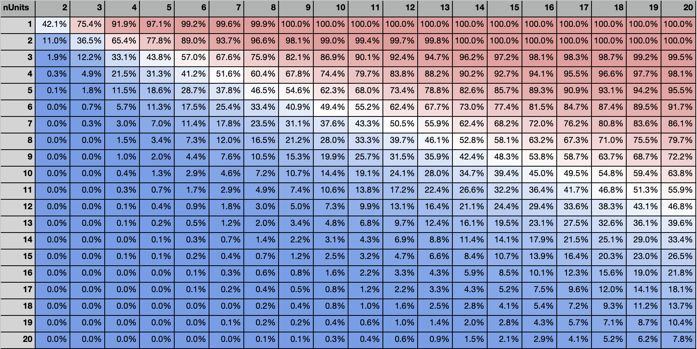
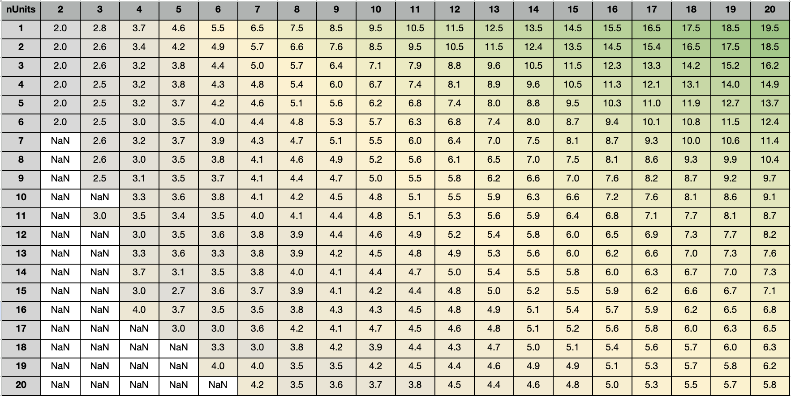

# Risk

This is a little Risk game that simulates battles between two players.

It's inspired by this reddit post https://www.reddit.com/gallery/1gyrpx4 (which is wrong btw).

Rows are the number of defending armies, columns are the number of attacking armies.

## % of winning when attacking
Red = Attacker wins most of the times, Blue = Defender wins most of the times

## % of expected units left when attacking

## Average % of units left when attacker wins

